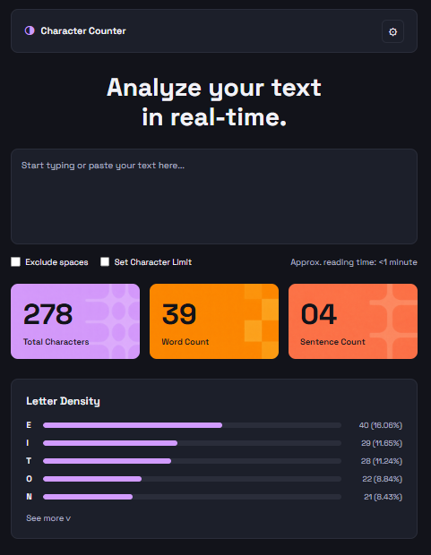

# Proyecto de Maquetado Web #

# Objetivo del proyecto
El objetivo de este proyecto es maquetar una interfaz web de un contador de caracteres, replicando un diseño de referencia utilizando únicamente HTML y CSS, sin JavaScript. Los valores mostrados son estáticos (hardcodeados), ya que la funcionalidad dinámica se agregará en una etapa posterior.

# Tecnologías utilizadas
- HTML5
- CSS3
- Google Fonts (Space Grotesk)
- Git y GitHub

# Cómo organicé el HTML

Utilicé etiquetas semánticas para que el código sea claro y bien estructurado:

- `<header>` para la cabecera, que contiene el logo con el ícono y el nombre del sitio, y un botón de configuración alineado a la derecha.
- `<main>` para englobar todo el contenido principal de la página.
- `<section class="hero">` para el título principal "Analyze your text in real-time."
- `<section class="textarea-section">` para el área de texto, usando la etiqueta `<textarea>` como indica el enunciado, con un placeholder descriptivo.
- `<section class="controls">` para los controles debajo del textarea: dos checkboxes con sus labels ("Exclude Spaces" y "Set Character Limit") y el texto de tiempo de lectura alineado a la derecha.
- `<section class="cards">` para las tres tarjetas de métricas (Total Characters, Word Count y Sentence Count), cada una con su número y etiqueta descriptiva.
- `<section class="density">` para la sección Letter Density, que contiene el título, las filas de letras con sus barras de progreso y porcentajes, y el botón "See more".

Cada fila de Letter Density está compuesta por:
- Un `` con la letra.
- Un `
` que actúa como contenedor de la barra.
- Un `
` con un ancho definido inline con `style="width: X%"`
  para representar visualmente la frecuencia de cada letra.
- Un `` con el conteo y porcentaje alineado a la derecha.

# Cómo resolví el CSS

**Variables CSS (`:root`)**
Centralicé toda la paleta de colores y la tipografía en variables CSS para poder reutilizarlas en todo el archivo y facilitar futuros cambios.

**Flexbox**
Lo usé en múltiples secciones:
- En `.header` para separar el logo del botón de configuración con `justify-content: space-between`.
- En `.cards` para distribuir las tres tarjetas en fila con `gap` entre ellas.
- En `.controls` para separar los checkboxes del texto de lectura.
- En `.density-row` para alinear horizontalmente la letra, la barra y el porcentaje.

**Imágenes de fondo en las cards**
Cada card usa `background-image` con su imagen correspondiente ubicada en `assets/images/`, combinada con `background-color` como fallback en caso de que la imagen no cargue. Se usó `background-size: cover` para que la imagen cubra toda la tarjeta correctamente.

**Barras de Letter Density**
Se resolvieron con dos divs anidados: el exterior (`.density-bar-wrap`) actúa como el fondo gris de la barra, y el interior (`.density-bar`) tiene el color lila y un ancho en porcentaje que representa la frecuencia de cada letra.

**Efectos interactivos**
- `.settings-btn:hover` cambia el fondo del botón al pasar el mouse.
- `.text-input:focus` cambia el borde del textarea al color lila cuando está activo.
- `.see-more:hover` aclara el color del botón "See more".

**Responsive**
Con `@media (max-width: 480px)` se adaptó el diseño para pantallas pequeñas: las cards pasan a apilarse verticalmente, el título reduce su tamaño y los controles se reorganizan en columna.

# Dificultades encontradas
- Entender cómo funciona Flexbox para distribuir los elementos correctamente, especialmente en la sección de controles y las cards.
- Lograr que las imágenes de fondo en las cards se vean bien usando `background-size: cover` combinado con el color de fondo como fallback.
- Implementar el diseño responsive fue un desafío, principalmente lograr que las cards pasaran de una fila horizontal a apilarse verticalmente en pantallas pequeñas sin que se rompiera el espaciado ni la proporción de los elementos internos.

# Capturas del resultado final
